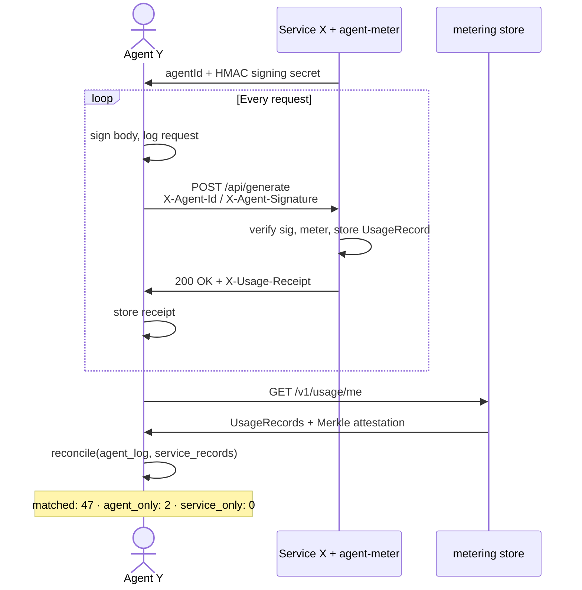

# agent-meter-rs

[](https://github.com/oztenbot/agent-meter-rs/actions/workflows/ci.yml)
[](https://crates.io/crates/agent-meter)
[](https://docs.rs/agent-meter)

Usage metering for the agent economy. Drop-in metering for APIs that serve AI agents.

Track every request, attribute it to an agent, and emit structured usage records. HMAC-signed, Merkle-attested, and designed for the billing infrastructure that's emerging around agent-to-service commerce.

Rust port of [agent-meter](https://github.com/oztenbot/agent-meter) (TypeScript/npm). HMAC signing matches the TypeScript implementation exactly — records signed by one SDK are verifiable by the other.

## How It Works



Agent Y signs every request. Service X meters and returns a signed receipt. Both parties keep a log. Reconciliation diffs them by `requestSignature` — the unforgeable correlation key.

**[Full flow documentation →](docs/e2e-flow.md)**

## Crates

| Crate | Description |
|-------|-------------|
| [`agent-meter`](crates/agent-meter) | Core library: types, transports, signing, attestation |
| [`agent-meter-axum`](crates/agent-meter-axum) | Tower/axum middleware layer (Service X side) |
| [`agent-meter-client`](crates/agent-meter-client) | Agent-side SDK: signing, request logging, reconciliation (Agent Y side) |

## Install

```toml
# Service X (the API being metered)
agent-meter = "0.1"
agent-meter-axum = "0.1"          # axum middleware
agent-meter = { version = "0.1", features = ["sqlite"] }  # optional SQLite

# Agent Y (the agent making requests)
agent-meter-client = "0.1"
```

## Quick Start

### With axum

```rust
use agent_meter::{AgentMeter, MeterConfig, MemoryTransport};
use agent_meter_axum::AgentMeterLayer;
use axum::{Router, routing::get, Json};
use std::sync::Arc;

#[tokio::main]
async fn main() {
    let transport = Arc::new(MemoryTransport::new());

    let meter = AgentMeter::new(MeterConfig {
        service_id: "my-api".to_string(),
        transport: Some(Arc::clone(&transport) as _),
        ..Default::default()
    });

    let app: Router = Router::new()
        .route("/api/widgets", get(|| async { Json(["a", "b", "c"]) }))
        .layer(AgentMeterLayer::new(meter).with_receipt_secret("svc-secret"));

    let listener = tokio::net::TcpListener::bind("0.0.0.0:3000").await.unwrap();
    axum::serve(listener, app).await.unwrap();
}
```

Agents identify themselves with the `X-Agent-Id` header. Every request from an identified agent produces a `UsageRecord`.

```bash
curl -H "X-Agent-Id: bot-123" -H "X-Agent-Name: WidgetBot" \
  http://localhost:3000/api/widgets
```

### Agent Y (making signed requests)

```rust
use agent_meter_client::{AgentClient, ClientConfig};

#[tokio::main]
async fn main() {
    let client = AgentClient::new(ClientConfig {
        agent_id: "agent-y".to_string(),
        agent_name: Some("MyAgent".to_string()),
        signing_secret: Some("shared-secret".to_string()),
        service_url: "http://localhost:3000".to_string(),
    });

    // Sign and send a request — logged automatically
    let body = serde_json::json!({"prompt": "hello"}).to_string();
    let resp = client.call("POST", "/api/generate", Some(&body)).await.unwrap();
    println!("status: {}, receipt: {:?}", resp.status_code, resp.receipt);

    // Reconcile local log against service records
    let report = client.reconcile().await.unwrap();
    println!("matched: {}  agent_only: {}  service_only: {}",
        report.summary.matched,
        report.summary.agent_only_count,
        report.summary.service_only_count,
    );
}
```

### Standalone (without a framework)

```rust
use agent_meter::{AgentMeter, IncomingRequest, MeterConfig, MemoryTransport};
use std::sync::Arc;

#[tokio::main]
async fn main() {
    let transport = Arc::new(MemoryTransport::new());

    let meter = AgentMeter::new(MeterConfig {
        service_id: "my-api".to_string(),
        transport: Some(Arc::clone(&transport) as _),
        ..Default::default()
    });

    // Call meter.record() from your request handler after the response is sent
    meter.record(
        IncomingRequest {
            method: Some("GET".to_string()),
            path: Some("/api/widgets".to_string()),
            agent_id: Some("bot-123".to_string()),
            agent_name: Some("WidgetBot".to_string()),
            status_code: Some(200),
            duration_ms: Some(12),
            ..Default::default()
        },
        None,
    );

    // Give the spawned task time to flush
    tokio::time::sleep(std::time::Duration::from_millis(10)).await;

    let summary = transport.summary(None);
    println!("records: {}, units: {}", summary.total_records, summary.total_units);
}
```

## Usage Records

Every metered request produces a structured record:

```json
{
  "id": "a1b2c3d4...",
  "timestamp": "2026-02-24T00:00:00.000Z",
  "serviceId": "my-api",
  "agent": {
    "agentId": "bot-123",
    "name": "WidgetBot"
  },
  "operation": "GET /api/widgets",
  "units": 1.0,
  "unitType": "request",
  "pricingModel": "per-call",
  "method": "GET",
  "path": "/api/widgets",
  "statusCode": 200,
  "durationMs": 12
}
```

## Transports

### MemoryTransport

In-memory storage. Best for testing and development. Cheap to clone — all clones share the same underlying buffer.

```rust
use agent_meter::{MemoryTransport, QueryFilter};
use std::sync::Arc;

let transport = Arc::new(MemoryTransport::new());

// After requests:
let all = transport.records();
let filtered = transport.query(Some(&QueryFilter {
    agent_id: Some("bot-123".to_string()),
    ..Default::default()
}));
let count = transport.count(Some(&QueryFilter {
    service_id: Some("my-api".to_string()),
    ..Default::default()
}));
let stats = transport.summary(None);
// stats.total_records, stats.total_units, stats.unique_agents
// stats.by_operation, stats.by_agent
```

### SQLiteTransport *(feature = "sqlite")*

Persistent local storage. Survives restarts. WAL mode enabled for concurrent reads.

```toml
[dependencies]
agent-meter = { version = "0.1", features = ["sqlite"] }
```

```rust
use agent_meter::{SqliteTransport, QueryFilter};

let transport = SqliteTransport::new("./usage.db", None).unwrap();
// or: SqliteTransport::new(":memory:", Some("my_table"))

// Query:
let records = transport.query(Some(&QueryFilter {
    agent_id: Some("bot-123".to_string()),
    limit: Some(100),
    ..Default::default()
})).unwrap();

let count = transport.count(None).unwrap();
let stats = transport.summary(None).unwrap();
```

### HttpTransport

Batches records and POSTs them to a backend. Retries with exponential backoff. Handles `429 Too Many Requests` with `Retry-After`.

```rust
use agent_meter::{HttpTransport, transport::http::HttpTransportOptions};
use std::{collections::HashMap, sync::Arc};

let mut headers = HashMap::new();
headers.insert("Authorization".to_string(), "Bearer sk-...".to_string());

let transport = HttpTransport::new(HttpTransportOptions {
    url: "https://billing.example.com/v1/usage/batch".to_string(),
    headers,
    batch_size: 10,           // flush every N records
    flush_interval_ms: Some(5000), // or every 5 seconds
    max_retries: 3,
    on_error: Some(Arc::new(|err, batch| {
        eprintln!("failed to send {} records: {}", batch.len(), err);
    })),
});
```

### AttestationTransport

Wraps any other transport and emits Merkle-attested batches. Each batch gets a signed `batchId:timestamp:merkleRoot` attestation that proves the full set of records wasn't tampered with.

```rust
use agent_meter::{
    AttestationTransport, MemoryTransport,
    transport::attestation::{AttestationTransportOptions, verify_attestation},
};
use std::sync::Arc;

let delegate = Arc::new(MemoryTransport::new());

let transport = AttestationTransport::new(AttestationTransportOptions {
    service_id: "my-api".to_string(),
    secret: "signing-secret".to_string(),
    batch_size: 10,
    on_attestation: Arc::new(|attestation| {
        println!(
            "batch {} attested: {} records, root {}",
            attestation.batch_id,
            attestation.record_count,
            &attestation.merkle_root[..8],
        );
        // verify:
        assert!(verify_attestation(&attestation, "signing-secret"));
    }),
    delegate: Some(delegate),
});
```

## axum Middleware

### Global (all routes)

```rust
use agent_meter::{AgentMeter, MeterConfig, MemoryTransport};
use agent_meter_axum::AgentMeterLayer;
use axum::Router;
use std::sync::Arc;

let meter = AgentMeter::new(MeterConfig {
    service_id: "my-api".to_string(),
    ..Default::default()
});

let app: Router = Router::new()
    // ... routes ...
    .layer(AgentMeterLayer::new(meter));
```

### Per-route options

Different pricing or unit counts per route:

```rust
use agent_meter::{AgentMeter, MeterConfig, PricingModel, RouteOptions};
use agent_meter_axum::AgentMeterLayer;
use axum::{Router, routing::post};

let meter = AgentMeter::new(MeterConfig {
    service_id: "my-api".to_string(),
    ..Default::default()
});

// Token-based pricing for the generate endpoint
let generate_layer = AgentMeterLayer::new(meter.clone())
    .with_options(RouteOptions {
        operation: Some("generate-text".to_string()),
        unit_type: Some("token".to_string()),
        pricing: Some(PricingModel::PerUnit),
        ..Default::default()
    });

// Skip metering for health checks
let health_layer = AgentMeterLayer::new(meter.clone())
    .with_options(RouteOptions {
        skip: true,
        ..Default::default()
    });

let app: Router = Router::new()
    .route("/api/generate", post(|| async {}).layer(generate_layer))
    .route("/health", axum::routing::get(|| async {}).layer(health_layer));
```

## Request Signing

Agents can sign requests with HMAC-SHA256 so your service can verify authenticity:

```rust
// Agent side — sign the request body before sending
use agent_meter::sign_payload;

let body = serde_json::to_string(&request_data).unwrap();
let signature = sign_payload(&body, &shared_secret);
// send as X-Agent-Signature header
```

```rust
// Service side — verify incoming signatures
use agent_meter::{AgentMeter, MeterConfig};

let meter = AgentMeter::new(MeterConfig {
    service_id: "my-api".to_string(),
    signing_secret: Some("shared-secret".to_string()),
    // Requests with invalid or missing signatures are silently dropped
    ..Default::default()
});
```

```rust
// Verify independently
use agent_meter::verify_signature;

let valid = verify_signature(&body, &signature, &secret);
```

## Configuration

```rust
use agent_meter::{AgentMeter, AgentIdentity, IncomingRequest, MeterConfig, PricingModel};
use std::sync::Arc;

let meter = AgentMeter::new(MeterConfig {
    // Required: bound to every record emitted
    service_id: "my-api".to_string(),

    // Where records go. Defaults to MemoryTransport.
    transport: None,

    // Default pricing model for all routes
    default_pricing: Some(PricingModel::PerCall),

    // Custom agent identity extraction (default: reads agent_id field)
    identify_agent: Some(Box::new(|req: &IncomingRequest| {
        // Wire to your auth middleware — identity should be verified,
        // not just asserted from a header
        req.agent_id.as_ref().map(|id| AgentIdentity {
            agent_id: id.clone(),
            tier: req.headers.get("x-agent-tier").cloned(),
            ..Default::default()
        })
    })),

    // HMAC secret — requests with invalid signatures are dropped
    signing_secret: Some("my-secret".to_string()),

    // Transform or filter records before emission; return None to drop
    before_emit: Some(Box::new(|mut record| {
        if record.path == "/health" {
            return None; // drop health checks
        }
        record.metadata = Some({
            let mut m = std::collections::HashMap::new();
            m.insert("region".to_string(), serde_json::json!("us-east-1"));
            m
        });
        Some(record)
    })),

    // Meter 4xx/5xx responses (default: false)
    meter_errors: false,
});
```

## RouteOptions

```rust
use agent_meter::{PricingModel, RouteOptions};
use std::collections::HashMap;

let opts = RouteOptions {
    // Override operation label (default: "METHOD /path")
    operation: Some("generate-text".to_string()),

    // Number of units (default: 1.0)
    units: Some(512.0),

    // Unit type label
    unit_type: Some("token".to_string()),

    // Pricing model for this route
    pricing: Some(PricingModel::PerUnit),

    // Arbitrary metadata attached to the record
    metadata: Some({
        let mut m = HashMap::new();
        m.insert("model".to_string(), serde_json::json!("gpt-4o"));
        m
    }),

    // Skip metering entirely for this route
    skip: false,
};
```

## Feature Flags

| Feature | Default | Description |
|---------|---------|-------------|
| `sqlite` | off | Enables `SqliteTransport` for persistent local storage. Bundles SQLite via rusqlite with the `bundled` feature — no system SQLite required. |

## Compatibility

The signing implementation (`sign_payload`, `verify_signature`) is byte-for-byte identical to the [TypeScript SDK](https://github.com/oztenbot/agent-meter). A record signed by an agent using `agent-meter` (npm) can be verified by a service using `agent-meter` (crates.io), and vice versa.

Attestation Merkle trees are also compatible — the same hashing scheme and leaf-duplication rule applies on both sides.

## Examples

Run the examples:

```bash
# Full end-to-end demo: signing, metering, receipts, and reconciliation
cargo run --example e2e --manifest-path crates/agent-meter-client/Cargo.toml

# Basic usage with MemoryTransport
cargo run --example basic --manifest-path crates/agent-meter/Cargo.toml

# Merkle attestation
cargo run --example attestation --manifest-path crates/agent-meter/Cargo.toml

# SQLite persistent transport
cargo run --example sqlite_transport --manifest-path crates/agent-meter/Cargo.toml \
  --features sqlite

# Full axum server
cargo run --example axum_server --manifest-path crates/agent-meter-axum/Cargo.toml
```

## License

MIT
