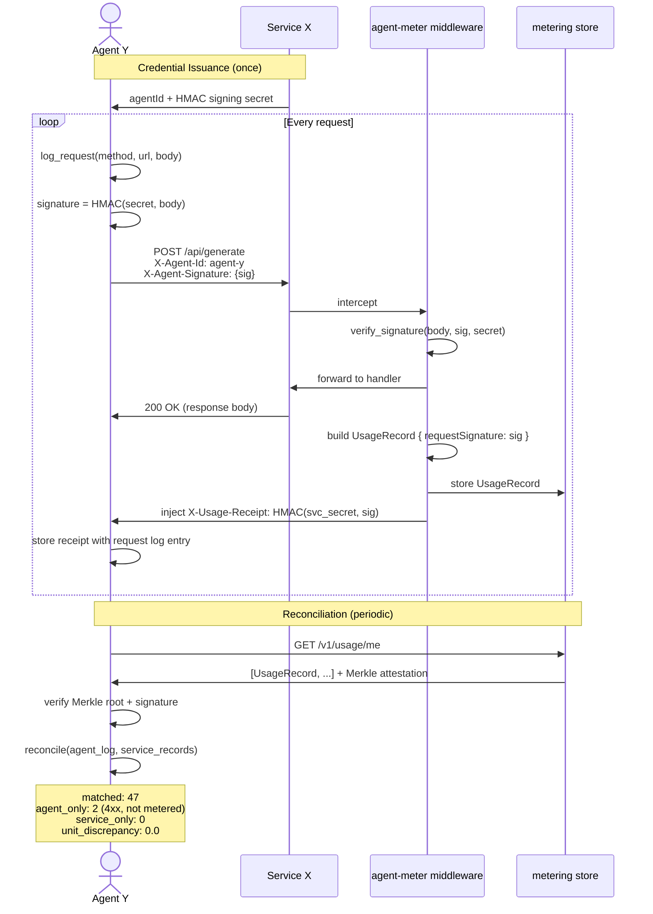

# End-to-End Flow: Signing, Metering, and Reconciliation

This document covers the full lifecycle of a metered agent request — from credential issuance through reconciliation. It's the trust model made concrete.

## The Three-Party Picture

```
Agent Y ←──────────────────────────────→ Service X
(makes requests)                         (runs your API + agent-meter)
        ↑                                         ↓
        └─────────── metering store ──────────────┘
                     (agent-meter-server)
```

Two distinct trust problems:

- **Service X** needs to know *who* is making a request and *how much* they consumed
- **Agent Y** needs to know that Service X's usage records accurately reflect *what they actually sent*

HMAC signing, signed receipts, and reconciliation close both gaps.

---

## Full Request Lifecycle



---

## Step by Step

### 1. Credential Issuance

Service X issues each agent:
- A stable `agentId` (the accounting key — never changes)
- A per-agent HMAC secret (used to sign request bodies)

This is a one-time out-of-band step, typically at agent registration. The secret is shared — both parties can compute and verify HMACs with it.

Service X wires identity verification to `identify_agent` in `MeterConfig`:

```rust
identify_agent: Some(Box::new(|req| {
    // Look up agentId from your API key store
    // Wire to your auth system here — don't trust headers blindly
    verify_api_key(&req.headers).ok()
}))
```

### 2. Request Signing (Agent Y)

Before each request, Agent Y:

1. Records the outgoing request in its local `RequestLog`
2. Signs the request body: `signature = HMAC(secret, body)`
3. Sends `X-Agent-Id` and `X-Agent-Signature` headers

```rust
let response = client.call("POST", "/api/generate", Some(&body)).await?;
// call() handles signing and logging internally
```

The signature is the correlation key. It appears in:
- Agent Y's `RequestLog` entry
- Service X's `UsageRecord.requestSignature`
- The signed receipt

### 3. Verification and Metering (Service X)

The `AgentMeterLayer` middleware:

1. Extracts `X-Agent-Signature` from the request
2. Forwards the request to the handler (no latency added — metering runs after response)
3. After the response is sent: verifies the signature, builds a `UsageRecord`, stores it
4. Injects `X-Usage-Receipt: HMAC(receipt_secret, requestSignature)` into the response

```rust
let app: Router = Router::new()
    .route("/api/generate", post(handler))
    .layer(
        AgentMeterLayer::new(meter)
            .with_receipt_secret("svc-receipt-secret")
    );
```

The receipt proves: "I received a request with this signature and recorded it."

### 4. Receipt Storage (Agent Y)

Agent Y stores the receipt alongside the request log entry. It can verify the receipt immediately:

```rust
// receipt = HMAC(svc_secret, requestSignature)
// If you know the service's receipt secret:
assert!(verify_signature(&signature, &receipt, &svc_receipt_secret));
```

In production, the service exposes a `/v1/receipts/verify` endpoint so agents can verify receipts without knowing the service's secret.

### 5. Reconciliation

Periodically, Agent Y downloads its usage records from Service X and reconciles:

```rust
// Download service's view
let service_records = client.download_usage().await?;

// Diff against local log
let report = client.reconcile(service_records);

println!("matched:          {}", report.summary.matched);
println!("agent_only:       {} (you sent, not metered)", report.summary.agent_only_count);
println!("service_only:     {} (metered, no matching request)", report.summary.service_only_count);
println!("unit_discrepancy: {}", report.summary.unit_discrepancy);
```

**Matching is by `requestSignature`** — the HMAC the agent created before sending. This is the unforgeable link between both parties' records.

**Interpreting the output:**

| Condition | Explanation |
|-----------|-------------|
| `agent_only > 0` | Calls you made that weren't metered. Usually 4xx responses (Service X configured `meterErrors: false`). Expected. |
| `service_only > 0` | Records Service X has that you have no corresponding request for. Investigate — could be a billing error or a replay attack. |
| `unit_discrepancy != 0` | You and Service X agree on which calls happened, but disagree on the unit count. Check per-route unit configuration. |
| All zeros | Clean. Your view matches Service X's view exactly. |

---

## What This Proves (and Doesn't)

**Proved:**
- Agent Y's requests weren't fabricated by Service X (Service X can't forge Agent Y's HMAC signatures)
- The batch of records wasn't tampered with in transit (Merkle attestation)
- Service X received and recorded each signed request (signed receipts)

**Not proved:**
- That Agent Y's identity is legitimate (identity verification is your auth system's job)
- That Service X didn't drop some requests before metering (agent_only can include legitimate underbilling)
- That Service X didn't fabricate unsigned records (reconciliation only covers signed requests)

This is the same trust model as financial statements — receipts plus statements, reconciled periodically, with disputes handled out-of-band.

---

## Running the Demo

```bash
cargo run --example e2e --manifest-path crates/agent-meter-client/Cargo.toml
```

The demo starts an in-process axum server with metering, runs an agent making 25 requests (mix of success and intentional errors), downloads the service's usage records, and prints a reconciliation report.

---

*See also: [README](../README.md) | [Security Deep Dive](https://github.com/oztenbot/agent-meter/blob/main/docs/security.md)*
